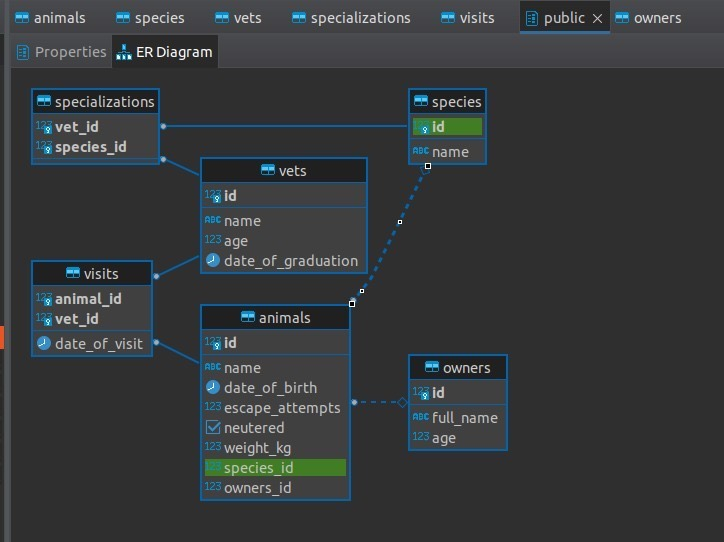

# Vet clinic database

> In this project I used a relational database to create the initial data structure for a vet clinic.

- ## Screenshot

## Getting Started

This repository includes files with plain SQL that can be used to recreate a database:

- Use [schema.sql](./schema.sql) to create all tables.
- Use [data.sql](./data.sql) to populate tables with sample data.
- Check [queries.sql](./queries.sql) for examples of queries that can be run on a newly created database.

## Authors

👤 **George**

- GitHub: [@Alexr16](https://github.com/Alexr16)
- Twitter: [@ReveloJ](https://twitter.com/ReveloJ)
- LinkedIn: [Jorge Ríos](https://www.linkedin.com/in/jorgeriosr/)

## 🤝 Contributing

Contributions, issues, and feature requests are welcome!

Feel free to check the [issues page](https://github.com/Alexr16/Vet-clinic-database/issues).

## Show your support

Give a ⭐️ if you like this project!

## Acknowledgments

- Thanks to my peers who are always there to offer support. 

## 📝 License

This project is [MIT](./LICENSE) licensed.

